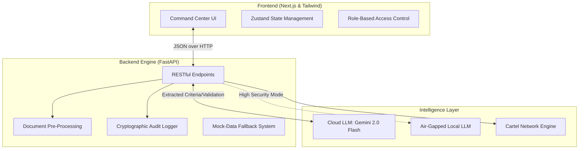

#  Procure AI: Explainable Procurement Intelligence Platform

[](https://www.hackerearth.com/community/challenges/hackathon/ai-for-bharat-2/)
[](#)
[](#)

**An AI-powered, cryptographically secure Tender Evaluation and Eligibility Analysis platform built for Indian Government Procurement.**

---

##  The Problem
Government organisations such as the Central Reserve Police Force (CRPF) issue tenders to procure goods and services. Evaluating whether each bidder meets the stated eligibility criteria is a manual, slow, and error-prone process. Bids arrive in heterogeneous formats (scanned PDFs, photos, regional languages, stamped physical documents). 

There is a critical need to automate this extraction and matching process **without ever silently disqualifying a bidder** due to AI ambiguity or illegible scans.

##  The Solution: Procure AI
Procure AI is an authoritative, "Human-in-the-Loop" (HITL) command center designed specifically for bureaucrats. It extracts complex criteria from government tenders, cross-references bidder documents, and generates cryptographically secured audit trails. 

Our core philosophy is **Deterministic Explainability**: Every AI decision is visually mapped, and every ambiguous document is safely routed to a human officer for manual triage or vendor resubmission.

---

##  Core Enterprise Features

### 1. Advanced Extraction & Bharat Edge-Cases
* **Heterogeneous Document Parsing:** Handles typed PDFs, scanned copies, and photographic evidence.
* **Indic Language & Stamp Detection:** Automatically flags translated regional text and verifies the presence of physical rubber stamps and authorized signatures.
* **Cross-Document Consistency:** Prevents forgery by cross-referencing entities (e.g., matching the PAN extracted from an IT Return against the PAN on an ISO Certificate).

### 2. Human-in-the-Loop (HITL) & Workflow
* **No Silent Disqualifications:** Ambiguous documents (e.g., blurry scans) trigger a "Needs Review" state, halting automatic rejection.
* **Vendor Resubmission Portal:** Allows officers to generate secure, time-limited links for bidders to re-upload illegible documents.
* **Maker-Checker Hierarchy:** Built-in role-switching between Junior Evaluators (Makers) and Procurement Directors (Checkers) for final digital sign-off.

### 3. Active Intelligence & Anti-Fraud
* **Cartel Network Graphing:** Detects "ring bidding" by highlighting shared IP addresses, CA registrations, or overlapping directors across supposedly competing bids.
* **Financial Anomaly Detection:** Flags predatory pricing if a bid is statistically lower than historical tender averages.
* **Visual Decision Trees:** Replaces "black-box" AI logic with renderable flowcharts proving exactly why a condition failed.

### 4. Cryptographic Auditability
* **Immutable Ledger:** Every automated extraction and human override is logged.
* **Cryptographic Hashing:** Final evaluation matrices are hashed (SHA-256) to provide mathematical proof against database tampering.

---

##  System Architecture

Procure AI uses a decoupled architecture ensuring high performance and the ability to run "air-gapped" in secure defense environments.


---

## Getting Started

First, run the development server:

```bash
npm run dev
# or
yarn dev
# or
pnpm dev
# or
bun dev
```

Open [http://localhost:3000](http://localhost:3000) with your browser to see the result.

You can start editing the page by modifying `app/page.tsx`. The page auto-updates as you edit the file.

This project uses [`next/font`](https://nextjs.org/docs/app/building-your-application/optimizing/fonts) to automatically optimize and load [Geist](https://vercel.com/font), a new font family for Vercel.

## Learn More

To learn more about Next.js, take a look at the following resources:

- [Next.js Documentation](https://nextjs.org/docs) - learn about Next.js features and API.
- [Learn Next.js](https://nextjs.org/learn) - an interactive Next.js tutorial.

You can check out [the Next.js GitHub repository](https://github.com/vercel/next.js) - your feedback and contributions are welcome!

## Deploy on Vercel

The easiest way to deploy your Next.js app is to use the [Vercel Platform](https://vercel.com/new?utm_medium=default-template&filter=next.js&utm_source=create-next-app&utm_campaign=create-next-app-readme) from the creators of Next.js.

Check out our [Next.js deployment documentation](https://nextjs.org/docs/app/building-your-application/deploying) for more details.
