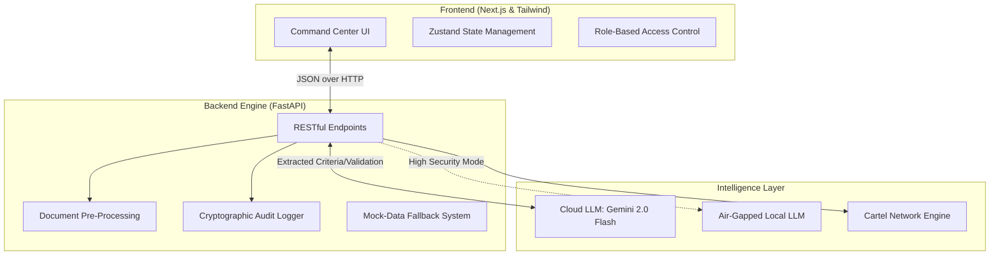

#  Procure AI: Explainable Procurement Intelligence Platform

[](https://www.hackerearth.com/community/challenges/hackathon/ai-for-bharat-2/)
[](#)
[](#)

**An AI-powered, cryptographically secure Tender Evaluation and Eligibility Analysis platform built for Indian Government Procurement.**

---

# Demo Links 

Link for the bidder-gateway : https://pro-cure-ai-nu.vercel.app/dashboard

Link for the Procure - AI : https://pro-cure-ai-6uzs.vercel.app/dashboard

---

##  The Problem
Government organisations such as the Central Reserve Police Force (CRPF) issue tenders to procure goods and services. Evaluating whether each bidder meets the stated eligibility criteria is a manual, slow, and error-prone process. Bids arrive in heterogeneous formats (scanned PDFs, photos, regional languages, stamped physical documents). 

There is a critical need to automate this extraction and matching process **without ever silently disqualifying a bidder** due to AI ambiguity or illegible scans.

##  The Solution: Procure AI
Procure AI is an authoritative, "Human-in-the-Loop" (HITL) command center designed specifically for bureaucrats. It extracts complex criteria from government tenders, cross-references bidder documents, and generates cryptographically secured audit trails. 

Our core philosophy is **Deterministic Explainability**: Every AI decision is visually mapped, and every ambiguous document is safely routed to a human officer for manual triage or vendor resubmission.

---

##  Core Enterprise Features

### 1. Advanced Extraction & Bharat Edge-Cases
* **Heterogeneous Document Parsing:** Handles typed PDFs, scanned copies, and photographic evidence.
* **Indic Language & Stamp Detection:** Automatically flags translated regional text and verifies the presence of physical rubber stamps and authorized signatures.
* **Cross-Document Consistency:** Prevents forgery by cross-referencing entities (e.g., matching the PAN extracted from an IT Return against the PAN on an ISO Certificate).

### 2. Human-in-the-Loop (HITL) & Workflow
* **No Silent Disqualifications:** Ambiguous documents (e.g., blurry scans) trigger a "Needs Review" state, halting automatic rejection.
* **Vendor Resubmission Portal:** Allows officers to generate secure, time-limited links for bidders to re-upload illegible documents.
* **Maker-Checker Hierarchy:** Built-in role-switching between Junior Evaluators (Makers) and Procurement Directors (Checkers) for final digital sign-off.

### 3. Active Intelligence & Anti-Fraud
* **Cartel Network Graphing:** Detects "ring bidding" by highlighting shared IP addresses, CA registrations, or overlapping directors across supposedly competing bids.
* **Financial Anomaly Detection:** Flags predatory pricing if a bid is statistically lower than historical tender averages.
* **Visual Decision Trees:** Replaces "black-box" AI logic with renderable flowcharts proving exactly why a condition failed.

### 4. Cryptographic Auditability
* **Immutable Ledger:** Every automated extraction and human override is logged.
* **Cryptographic Hashing:** Final evaluation matrices are hashed (SHA-256) to provide mathematical proof against database tampering.

---

## The Bidder-Side Mobile App: "Procure-Link"

While the Government Portal handles evaluation, the Procure-Link Mobile App is the gateway for bidders. It is designed to be a "Smart Scanner" that ensures high-quality data ingestion before a bid is even submitted.

1. Intelligent Mobile Ingestion
Vision-Guided Document Capture: Uses real-time edge detection to ensure bidders take clear, un-skewed photos of physical certificates and stamps.

   On-Device OCR Pre-check: Instantly alerts the bidder if a document is blurry or if mandatory fields (like a GSTIN or PAN) are missing before they upload.

   Offline First Mode: Allows bidders in low-connectivity areas to scan and package their entire tender dossier locally, sync-uploading once they reach stable         internet.

2. Bidder Empowerment & Transparency
Real-Time Status Tracking: Bidders can see exactly which stage of the "AI Auto-Structuring" their bid is in—no more "black hole" waiting periods.

    Instant Triage Requests: If an official marks a document as "Needs Review," the bidder receives a push notification and can re-upload the specific document         instantly via the app.

    Cryptographic Receipt: Upon submission, the app generates a unique SHA-256 hash receipt on the bidder's phone, serving as mathematical proof of their original submission.

3. Technical Specifications (Mobile)
    Framework: React Native / Expo (for cross-platform iOS & Android deployment).

    Local Intelligence: Core ML / TensorFlow Lite for on-device document classification and blur detection.

    Secure Tunneling: Uses TLS 1.3 encryption to transmit sensitive financial data directly to the Procure AI Private Cloud.

---

## Integrated Workflow

1. The Bidder scans a document via the Mobile App.

2. The AI (Gemini 2.0) extracts the data and logs it in the Secure Ledger.

3. The Government Official views the extraction on the Command Center Monitor.

4. The System triggers a "Decision Dossier" that both parties can Export & Print.

---

##  System Architecture

Procure AI uses a decoupled architecture ensuring high performance and the ability to run "air-gapped" in secure defense environments.


---

## Getting Started

First, run the development server:

```bash
npm run dev
# or
yarn dev
# or
pnpm dev
# or
bun dev
```

Open [http://localhost:3000](http://localhost:3000) with your browser to see the result.

You can start editing the page by modifying `app/page.tsx`. The page auto-updates as you edit the file.

This project uses [`next/font`](https://nextjs.org/docs/app/building-your-application/optimizing/fonts) to automatically optimize and load [Geist](https://vercel.com/font), a new font family for Vercel.

## Learn More

To learn more about Next.js, take a look at the following resources:

- [Next.js Documentation](https://nextjs.org/docs) - learn about Next.js features and API.
- [Learn Next.js](https://nextjs.org/learn) - an interactive Next.js tutorial.

You can check out [the Next.js GitHub repository](https://github.com/vercel/next.js) - your feedback and contributions are welcome!

## Deploy on Vercel

The easiest way to deploy your Next.js app is to use the [Vercel Platform](https://vercel.com/new?utm_medium=default-template&filter=next.js&utm_source=create-next-app&utm_campaign=create-next-app-readme) from the creators of Next.js.

Check out our [Next.js deployment documentation](https://nextjs.org/docs/app/building-your-application/deploying) for more details.


---

## Mock Files & Upload Instructions

To test ProCure-AI locally and simulate a real-world vendor submission, use the pre-provided mock assets. These files are designed to trigger specific AI extraction and validation logic within the platform.

## Where to find them?

All mock files are located in the repository at:

bidder-gateway/public/demo_assets/

## How to use them?

When running the Bidder Gateway locally, upload the following files into their respective fields to see the AI in action:


---

## Future Roadmap

Blockchain Integration: Moving from a centralized cryptographic ledger to a decentralized Hyperledger Fabric for cross-departmental trust.

Multilingual Voice Interface: Enabling bidders to inquire about tender status using regional Indian dialects via Bhashini API integration.

Predictive Workload Balancing: AI-driven suggestions for human evaluators based on their historical domain expertise in specific procurement categories (e.g., Electronics vs. Civil Works).

---

## Contributing & Collaboration

This project was developed for the AI for Bharat 2 Hackathon. 

We are open to collaboration with government tech entities to further refine the "Deterministic Explainability" engine.

---

## License & Security

License: Distributed under the MIT License.

Security: This repository uses a high-priority .gitignore to prevent the exposure of Google Gemini API keys and sensitive environment variables. 

All previously detected secrets have been fully revoked and rotated.

---

## Developed by Team ProCure-AI

Focus Theme: CRPF Tender Evaluation & Eligibility Analysis

Project Lead: B.Bhuvana Sarada

Hackathon: AI for Bharat 2 (2026)

---


